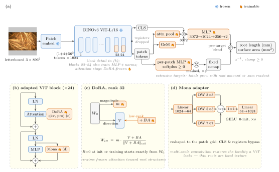

# RootQuant-V2

**Segmentation-free root-trait regression from minirhizotron imagery with a frozen DINOv3 backbone.**

**Paper:** [*RootQuantV2: Adapting a Vision Foundation Model for Root-Trait
Regression from Minirhizotron Imagery*](https://arxiv.org/abs/2609.25567) —
arXiv:2609.25567. Accepted to the Computer Vision in Plant Phenotyping and
Agriculture (CVPPA) Workshop at ECCV 2026.

RootQuant-V2 predicts two scalar root traits — living root **length** (mm) and
**surface area** (mm²) — directly from a single RGB minirhizotron frame. There is
no segmentation step and no pixel-level supervision: the model is trained against
the per-image scalar totals that minirhizotron archives already contain, so
existing numeric-only archives become training data and no new manual tracing is
required.

A **DINOv3 ViT-L/16 backbone stays completely frozen**. Adaptation is
parameter-efficient — DoRA on the attention projections, a Mona multi-scale
convolutional adapter on the MLP branch, a learnable pool, and a density-style
extensive readout. The headline model trains **11.90 M parameters, 3.78 % of the
model** (the trainer prints the exact breakdown at startup).

This repository contains the **code and the trained weights**. The dataset is not
distributed, and neither are evaluation results; for accuracy figures see the
[paper](https://arxiv.org/abs/2609.25567).

<p align="center">
  
  <br><em>Frozen ViT-L/16 + DoRA + Mona → pooled and density readouts → (length, area).
  <a href="docs/assets/architecture.pdf">PDF</a> · <a href="docs/assets/architecture.tex">TikZ source</a></em>
</p>

---

## Quickstart

### 1. Install

```bash
git clone https://github.com/leakey-lab/RootQuantV2.git
cd RootQuantV2

python -m venv .venv && source .venv/bin/activate      # or conda
# Install torch matched to your CUDA build first (see requirements.txt).
pip install torch==2.11.0 torchvision==0.26.0 --index-url https://download.pytorch.org/whl/cu126
pip install -r requirements.txt
```

Everything runs from the **repository root** as `python -m RootQuantV2.<module>` —
there is nothing to `pip install -e`.

### 2. Get the DINOv3 backbone

The frozen backbone is Meta's and is not redistributed here. Download
`dinov3_vitl16_pretrain_lvd1689m-8aa4cbdd.pth` (~1.2 GB) under the DINOv3
License and drop it in `RootQuantV2/dinov3/`, or point `DINOV3_CHECKPOINT_PATH`
at it. Keep the original file name. Full instructions:
[`RootQuantV2/dinov3/README.md`](RootQuantV2/dinov3/README.md).

The first run also fetches Meta's DINOv3 model code from GitHub through
`torch.hub` (cached under `~/.cache/torch/hub` afterwards).

### 3. Get a trained checkpoint

```bash
python tools/download_checkpoints.py --list     # what's available
python tools/download_checkpoints.py            # the headline model (91 MB)
python tools/download_checkpoints.py --all      # every released checkpoint
```

Checkpoints land in `RootQuantV2/runs/checkpoints/<name>/best.pt` and every
download is SHA-256 verified against [`checkpoints.json`](checkpoints.json). See
[Model weights](#model-weights) below.

### 4. Predict on your own images

```bash
python -m RootQuantV2.predict --images /path/to/frames --out predictions.csv
```

```
image                                pred_length_mm   pred_area_mm2
frame_0001.jpg                                0.021           0.095
frame_0002.jpg                                2.527           1.850
```

No labels needed. `--images` takes files or directories; `--csv` reads image
names from a column instead. D4 test-time augmentation follows the checkpoint's
own setting (on for all released models) — `--no-tta` makes it 8× faster at a
small accuracy cost. Checkpoints carry their own config and target statistics,
so nothing else has to be specified.

---

## Model weights

Trained weights are hosted on Google Drive, not in git.

> **Drive folder:** <https://drive.google.com/drive/folders/1dPkiepx5tDsctXCahvv0E8LYo2zkyaVQ?usp=sharing>

Release names follow the paper: `rootquant-v2-weights` is the full (headline)
model, and every other file is named for what differs from it.
The Drive file is `<name>.pt`; *trained as* is the `run_name` the trainer wrote it
under (`config.py` profile + ablation), for matching logs and scripts.

| name | size | trained as | configuration |
|---|---|---|---|
| `rootquant-v2-weights` | 91 MB | `v2_dinov3_mona768_v3` | **Headline (full model).** 896 px, DoRA r=32 + Mona, frozen backbone, trained on the mixed soybean + maize split. Start here. |
| `rootquant-v2-768px` | 59 MB | `v2_dinov3_mona768_v2` | 768 px, DoRA r=16 + Mona. † |
| `rootquant-v2-dora-only` | 65 MB | `v2_dinov3_mona768_v3_no-mona` | Headline recipe with the Mona adapter removed (DoRA untouched). |
| `rootquant-v2-unfreeze-last2` | 219 MB | `v2_dinov3_mona768_v3_unfreeze-last2` | Last two ViT blocks unfrozen at a low LR (MLP, LayerNorm and LayerScale `ls1`/`ls2` weights; attention stays frozen behind the DoRA buffer). † |
| `rootquant-v2-soybean-only` | 91 MB | `xspecies_soy_v3` | Trained on soybean only. † |
| `rootquant-v2-soybean-to-maize-fcft` | 91 MB | `xspecies_fcft_v3` | Warm-started from the soybean-only model, readout-only fine-tune on maize (FCFT). The file also holds the frozen soybean-only adapters it runs on. † |
| `rootquant-v2-soybean-to-maize-fft` | 91 MB | `xspecies_fft_v3` | Warm-started from the soybean-only model, full fine-tune on maize (FFT). † |
| `rootquant-v2-dora-baseline-640px` | 1.2 GB | `v2_dinov3_dora_reg` | 640 px DoRA baseline, no Mona. Optional — an early checkpoint format that stores the frozen backbone inline. |

† Trained without tile-shuffle augmentation. These runs predate the tile-shuffle
setting (their configs have no tile-shuffle keys), while the current
`dinov3_dora_mona_768*` profiles turn it on. To reproduce them, disable it:
`TILE_SHUFFLE=0` for `run_train.sh`, `--no-use_tile_shuffle` for `train.py`
(`run_cross_species.sh` and `run_maize_ft.sh` already default to
`TILE_SHUFFLE=0`).

Each checkpoint holds the run's full config, the fitted target statistics, and
its weights — the EMA weights for every model except the 640 px baseline, which
was trained without EMA — so `predict.py` / `infer.py` rebuild the model without
any extra flags. The slim checkpoints omit the frozen backbone (it is
reconstructed from your local DINOv3 file), which is why they are ~91 MB instead
of ~1.2 GB. The exact settings of any checkpoint (epochs, batch, profile,
ablation) are in its config:

```bash
python -c "import torch; print(torch.load('RootQuantV2/runs/checkpoints/rootquant-v2-weights/best.pt', map_location='cpu', weights_only=False)['cfg'])"
```

Prefer to grab a file by hand? Download `<name>.pt` from the Drive folder, save it
as `RootQuantV2/runs/checkpoints/<name>/best.pt`, then confirm the hash:

```bash
python tools/download_checkpoints.py <name> --verify-only
```

---

## Data layout

The dataset is not distributed with this repository. To train or evaluate on
your own, the loader expects three CSVs and an image directory:

```
$ROOTQUANT_DATA_DIR/
├── train_data.csv
├── val_data.csv
├── test_data.csv
└── images/          # every image referenced by the CSVs, flat
```

Each CSV needs three columns. The names below are the defaults; change
`image_col`, `length_col` and `area_col` in `RootQuantV2/config.py` if yours
differ (read by `train.py`, `infer.py` and `infer_dual.py`).

| column | meaning |
|---|---|
| `ImageName` | file name inside the image directory |
| `AliveLength(mm)` | living root length, mm |
| `AliveSurfArea(mm2)` | living root surface area, mm² |

A row counts as **present** only when length > 0 **and** area > 0; every other
row (normally both `0`, no root visible) is **empty**. Empty rows are kept in
training (predicting zero is correct and learnable) but present rows are
up-weighted, because empty frames dominate a typical minirhizotron series.
Metrics (R², RMSE, MAE) are computed on present rows.

Point the code at your data once:

```bash
export ROOTQUANT_DATA_DIR=/abs/path/to/dataset
export ROOTQUANT_IMAGES=/abs/path/to/dataset/images   # optional, if images live elsewhere
export ROOTQUANT_SOY_DIR=/abs/path/to/soy_split       # cross-species scripts only
export ROOTQUANT_MAIZE_DIR=/abs/path/to/maize_split   # cross-species scripts only
```

`--train_csv` / `--val_csv` / `--test_csv` / `--data_path` on the CLI override
these at any time. There is no default location: a command that reads the
dataset stops with a message if these are unset. `predict.py` needs none of them.

**Per-species splits.** The cross-species scripts (`run_cross_species.sh`,
`run_maize_ft.sh`) and the per-species evaluation (`infer_dual.py`,
`run_infer_all.sh`) also need one split per species, with the same three CSVs
and columns; images are read from the shared image directory:

```
$ROOTQUANT_SOY_DIR/        (default $ROOTQUANT_DATA_DIR/soy)
├── train_data.csv
├── val_data.csv
└── test_data.csv
$ROOTQUANT_MAIZE_DIR/      (default $ROOTQUANT_DATA_DIR/maize)
├── train_data.csv
├── val_data.csv
└── test_data.csv
```

The mixed `$ROOTQUANT_DATA_DIR/test_data.csv` is expected to be the union of the
two species' test splits; `infer_dual.py` tags each row by which species CSV
lists its image name. If `ROOTQUANT_SOY_DIR`, `ROOTQUANT_MAIZE_DIR` and
`ROOTQUANT_IMAGES` are all set, the cross-species scripts do not need
`ROOTQUANT_DATA_DIR`.

---

## Training

```bash
# single GPU
GPUS=0 bash RootQuantV2/run_train.sh

# 4-GPU DDP (one process per listed GPU, via torch.distributed.run)
GPUS=0,1,2,3 bash RootQuantV2/run_train.sh

# a different profile or ablation
PROFILE=dinov3_dora_mona_768_v2 GPUS=0,1 bash RootQuantV2/run_train.sh
ABLATE=no-mona GPUS=0,1,2,3 bash RootQuantV2/run_train.sh
```

`run_train.sh` builds the argv, launches inside a detached tmux session, tees to
`RootQuantV2/logs/`, checks that the DINOv3 checkpoint exists, and optionally
stages the image corpus to `/dev/shm` so DataLoader workers are decode-bound
rather than network-FS-bound (`STAGE_SHM=0` disables it). It needs **tmux**, and
**rsync** for the staging step. It resolves the dataset paths itself and passes
them to `train.py` as flags, so they survive an already-running tmux server.

**Headline recipe.** `GPUS=0,1,2,3 bash RootQuantV2/run_train.sh` with no other
settings trains the released configuration: profile `dinov3_dora_mona_768_v3`
(tile-shuffle on, grids 2/4/8 at p 0.3/0.2/0.1), 20 epochs, per-GPU batch 4 on
4 GPUs (effective batch 16), seed 42, fp32 with TF32 matmuls. The released
`rootquant-v2-weights` run used this 20-epoch schedule in two parts: epochs 0–7
ran on one GPU at per-GPU batch 8, then the run was resumed from `last.pt` at
epoch 8 on 4 GPUs at per-GPU batch 4 (the resume re-anchors the cosine LR
schedule to the completed-epoch fraction). `best.pt` is epoch 12, selected by
validation combined R² (mean of length and area R²). At that resume the EMA copy
restarted from the initial weights, a bug fixed since; by epoch 12 their weight
in the EMA is below 1e-6. `rootquant-v2-dora-only` was trained the same way
with `ABLATE=no-mona`.

Everything is env-overridable:

| variable | effect |
|---|---|
| `PROFILE` | config profile (default `dinov3_dora_mona_768_v3`) |
| `ABLATE` | ablation key, e.g. `no-mona`, `frozen`, `unfreeze-last2` |
| `GPUS` | comma-separated device ids; count sets `nproc_per_node` |
| `BATCH`, `GRAD_ACCUM_STEPS` | per-GPU batch (default `4`; `BATCH=` empty = the profile's own) and accumulation |
| `NUM_EPOCHS`, `LR_DORA`, `LR_HEAD`, `LR_MONA`, `HEAD_DROPOUT`, `SEED` | schedule (default 20 epochs) and optimizer |
| `TARGET_SIZE`, `POOL`, `AMP`, `GRAD_CKPT` | resolution, pooling, precision (`fp32` default, `bf16` opt-in), activation checkpointing |
| `TILE_SHUFFLE`, `TILE_SHUFFLE_GRIDS`, `TILE_SHUFFLE_P` | tile-shuffle: `1` on, `0` off, empty = profile default; grid sizes and per-grid probabilities, e.g. `2,4,8` and `0.3,0.2,0.1` |
| `W_EMPTY`, `W_PRESENT` | presence balancing (`W_EMPTY=0` = train on present rows only) |
| `TRAIN_CSV`, `VAL_CSV`, `TEST_CSV`, `DATA_PATH` | dataset paths (default: from `ROOTQUANT_DATA_DIR` / `ROOTQUANT_IMAGES`) |
| `RUN_NAME`, `OUTPUT_ROOT` | run directory name (default: the profile's `run_name` plus `_<ablation>`) and output root (default `RootQuantV2/runs`) |
| `RESUME`, `INIT_FROM`, `FINETUNE_MODE` | continue a run, or warm-start a new dataset (`fc_only` / `full`) |
| `DINOV3_CHECKPOINT_PATH` | backbone weights file (default `RootQuantV2/dinov3/dinov3_vitl16_pretrain_lvd1689m-8aa4cbdd.pth`) |
| `STAGE_SHM`, `SHM_DIR`, `RESTAGE` | image staging to local tmpfs |
| `SESSION` | tmux session name (default built from profile, batch and GPUs) |

Direct invocation works too, with the same knobs as CLI flags:

```bash
python -m RootQuantV2.train --profile dinov3_dora --readout density --loss_type mse
```

Note that `python -m RootQuantV2.train` has its own defaults — the 640 px
`dinov3_dora` profile, 30 epochs, the profile's per-GPU batch — so to match the
headline run pass `--profile dinov3_dora_mona_768_v3 --num_epochs 20
--per_gpu_batch 4` and launch 4 processes with `torchrun`.

Outputs: checkpoints in `RootQuantV2/runs/checkpoints/<run_name>/{best,last}.pt`,
TensorBoard in `RootQuantV2/runs/logs/<run_name>/`.

**Reference hardware.** 4× A100-SXM4-80GB, fp32 with TF32 matmuls, no autocast.
At 896 px with grad-checkpointing off the job peaks near 37 GB per GPU at batch 8.
Attention is quadratic in token count, so 640 px runs roughly 2× the throughput
of 768 px — use the 640 px profile for fast A/Bs and the 896 px v3 profile for
the final model.

### Fine-tuning on your own species or dataset

```bash
INIT_FROM=RootQuantV2/runs/checkpoints/rootquant-v2-weights/best.pt \
FINETUNE_MODE=fc_only \
ROOTQUANT_DATA_DIR=/path/to/your/dataset \
GPUS=0 bash RootQuantV2/run_train.sh
```

`--init_from` loads the adapter, pooler and head weights only (not the
optimizer, epoch or target statistics — those are refit on your split). `FINETUNE_MODE=fc_only`
freezes the whole feature extractor and trains just the regression readout,
which is the right first attempt on a small dataset; `full` trains the entire
warm-started adapter set, which is stronger in-domain but degrades performance
on the source species.

### Evaluating on a labelled split

```bash
python -m RootQuantV2.infer \
  --checkpoint RootQuantV2/runs/checkpoints/rootquant-v2-weights/best.pt \
  --csv "$ROOTQUANT_DATA_DIR/test_data.csv" \
  --data_path "$ROOTQUANT_DATA_DIR/images"
```

Prints R² / RMSE / MAE per target on present rows, and writes per-image
predictions with `--output_csv` (columns `image, pred_length, pred_area,
true_length, true_area`); `--data_path` defaults to `$ROOTQUANT_IMAGES` /
`$ROOTQUANT_DATA_DIR/images`.

- `plot_regression.py` renders predicted-vs-measured scatters from that
  `infer.py --output_csv` file.
- `infer_dual.py` scores the mixed-species test split in one pass, vanilla and
  D4-TTA side by side, tagging each row by species (needs the per-species splits
  above). Its CSV has `species, pred_*_vanilla, pred_*_tta, true_*` columns.
- `aggregate_metrics.py` folds a directory of `infer_dual.py` CSVs into one
  table (model × species × mode × target); it does not read `infer.py` CSVs.
- `run_infer_all.sh` runs `infer_dual.py` on every
  `RootQuantV2/runs/checkpoints/*/best.pt` and aggregates the results
  (`GPUS=0,1 BATCH=32 bash RootQuantV2/run_infer_all.sh`);
  `run_fft_infer_parallel.sh` shards one checkpoint's evaluation across several
  GPUs (`NAME=<checkpoint name> GPUS=0,1,2,3`).

```bash
python -m RootQuantV2.infer_dual \
  --checkpoint RootQuantV2/runs/checkpoints/rootquant-v2-weights/best.pt \
  --model_name rootquant-v2-weights \
  --mixed_csv "$ROOTQUANT_DATA_DIR/test_data.csv" \
  --data_path "$ROOTQUANT_DATA_DIR/images" \
  --soy_csv   "$ROOTQUANT_SOY_DIR/test_data.csv" \
  --maize_csv "$ROOTQUANT_MAIZE_DIR/test_data.csv" \
  --output_csv RootQuantV2/runs/inference_eval/preds/rootquant-v2-weights.csv
python -m RootQuantV2.aggregate_metrics \
  --preds_dir RootQuantV2/runs/inference_eval/preds \
  --out_csv   RootQuantV2/runs/inference_eval/metrics_summary.csv
```

---

## Method notes

- **Frozen backbone, PEFT adaptation.** DINOv3 ViT-L/16 never updates. DoRA
  (weight-decomposed low-rank adaptation) adapts the attention projections; a
  **Mona** parallel multi-scale depthwise-conv adapter (3×3 / 5×5 / 7×7) on the
  MLP branch restores the 2-D locality that a flat ViT plus linear PEFT lacks.
  Both are no-ops at initialization.
- **Extensive readout.** Length and area are *extensive* — they grow with how
  much root is in frame — while every pooling operator is *intensive* (an
  average). `DensityReadout` predicts a non-negative per-patch density, zeroes
  the letterbox padding, and **sums** over patches, so an empty frame maps
  exactly onto the empty-row target. `readout=both` learns a per-target blend
  with the pooled global head, so it cannot regress below global-only.
- **Loss matched to the metric.** On present rows R²_raw = 1 − MSE_z, so MSE
  maximizes that metric. The released profiles use **Huber with δ=3** —
  quadratic across the realistic residual range, clipping only pathological
  outliers. The legacy `smooth_l1(β=1)` caps the gradient at 1σ, which is exactly
  where the heavy-tail large roots live.
- **Targets stay in raw mm.** Z-scored on present rows, not log-transformed. Log
  targets minimize *relative* error while the reported metric is raw-unit R².
  The `log_zscore` knob still exists for relative-error experiments, but the
  density readout is only valid in an additive target space.
- **Preprocessing.** Letterbox to a square canvas (aspect preserved, padding
  tracked by a per-patch validity mask), then ImageNet normalization to match
  DINOv3 pretraining. Training-time D4 symmetry augmentation, photometric
  jitter, and — in the 768/896 px profiles — a multi-scale tile-shuffle
  regularizer. Tile-shuffle permutes image tiles only; the patch validity mask
  is not permuted with them.
- **Test-time augmentation.** Flips and rotations preserve length and area
  exactly, so predictions are averaged over the input's symmetry group: the full
  8-element D4 group for square letterboxed inputs, D2 (4 views) for
  non-square. Image and patch mask are transformed by the same group element.
- **fp32 with TF32 matmuls.** Weights and activations stay fp32 (no autocast,
  no GradScaler); matmuls and convolutions use TF32 tensor cores on GPUs that
  have them (`allow_tf32` in `config.py`). `AMP=bf16` exists as an opt-in
  override.

### Config profiles

`RootQuantV2/config.py` is the single source of truth;
`get_config(profile, ablation)` returns a deep copy.

| profile | res | adapters | pool | readout | notes |
|---|---|---|---|---|---|
| `dinov3_dora` | 640 | DoRA r=16 on attn + MLP | `cls_mean_max` | global | baseline, smooth-L1, compile on |
| `dinov3_dora_mona_768` | 768 | DoRA-attn + Mona | `cls_attn_gem` | global | grad-checkpointing on, tile-shuffle on |
| `dinov3_dora_mona_768_v2` | 768 | DoRA-attn + Mona | `cls_attn_gem` (softplus) | both | Huber δ=3, EMA, D4 TTA |
| **`dinov3_dora_mona_768_v3`** | **896** | **DoRA r=32 + Mona** | `cls_attn_gem` (softplus) | **both** | **headline** — task weights (1, 1.5), head (1024, 256), grad-checkpointing off, compile on |

Ablations via `ABLATE=` / `--ablate`: `frozen`, `no-mona`, `dora-last6`,
`cls-only`, `learned-pool`, `unfreeze-last2`, `unfreeze-last2-no-mona`,
`area-weight`, `present-only`, `768-only`.

---

## Interpretability

The backbone's CLS-attention, PCA and cosine maps are computed on adapted
tokens (DoRA and Mona sit in the frozen backbone's forward path), but they stay
task-agnostic — they segment any texture, including soil, and are *not*
evidence about what the regressor learned (`viz_root_panel.py --compare_frozen`
shows the same PCA on un-adapted DINOv3 tokens next to it). The task-faithful
map is the trained head's per-patch `DensityReadout`, whose masked sum **is**
the prediction.

```bash
python -m RootQuantV2.visualize_attention --n 4 --out_dir RootQuantV2/viz_attention
python -m RootQuantV2.rank_empty_density --out_csv RootQuantV2/viz_analysis/empty_density_ranking.csv
python -m RootQuantV2.montage_density \
    --ranking_csv RootQuantV2/viz_analysis/empty_density_ranking.csv \
    --out RootQuantV2/viz_analysis/montage_mislabeled.png --n 15
python -m RootQuantV2.viz_mona_pair --map length      # Mona on vs. off, same frames
python -m RootQuantV2.viz_tta_d4 --image frame.jpg    # the 8 D4 views TTA averages
```

Sampling modes (`visualize_attention`, `rank_empty_density`, `viz_mona_pair`
without `--images`) read the labelled test split, so they need
`ROOTQUANT_DATA_DIR` (or `--csv` / `--data_path`). Output paths are relative to
the working directory.

That density map doubles as a **label-error detector**: bright, structured
density on a frame labelled empty means a root the annotation missed, which
makes `rank_empty_density.py` a re-annotation queue. Full documentation:
[`RootQuantV2/docs/visualization.md`](RootQuantV2/docs/visualization.md).

---

## Repository layout

```
README.md                     this file
checkpoints.json              released-checkpoint manifest (Drive ids + SHA-256)
requirements.txt              runtime dependencies
tools/download_checkpoints.py checkpoint downloader + verifier
docs/assets/                  architecture figure (SVG, PDF, TikZ source)

RootQuantV2/                  the python package — run as `python -m RootQuantV2.<module>`
├── config.py                 all hyperparameters, profiles and ablations
├── model.py                  DinoV3RootRegressor, pooling, RegressionHead, DensityReadout, TTA
├── train.py                  training CLI  (argparse → get_config → Trainer.fit)
├── predict.py                run a checkpoint on unlabelled images
├── infer.py                  score a checkpoint on a labelled split
├── infer_dual.py             mixed test set, vanilla + TTA, split per species
├── aggregate_metrics.py      fold infer_dual.py CSVs into one metric table
├── plot_regression.py        predicted-vs-measured scatter from an infer.py CSV
├── backbone/dinov3.py        frozen DINOv3 ViT-L/16 wrapper
├── peft/{dora,mona}.py       the two adapters
├── data/                     dataset, letterbox/augmentation transforms, target normalization
├── training/                 trainer (DDP, EMA, cosine schedule), loss, checkpoint io
├── docs/visualization.md     saliency and density-map guide
├── dinov3/                   ← put the DINOv3 backbone weights here
├── visualize_attention.py    saliency boards; its model loader is shared by the
│                             rank / montage / viz_mona_pair scripts
├── rank_empty_density.py     rank gt-empty frames by summed head density (label errors)
├── montage_density.py        top-N montage of likely-mislabeled empty frames
├── montage_all_pairs.py      full contact sheet (PDF) of every flagged empty frame
├── viz_mona_pair.py          head density of two checkpoints (Mona on vs. off)
├── viz_root_panel.py         input | feature PCA | density figure grid
├── viz_tta_d4.py             the 8 D4 views that TTA averages, with per-view predictions
├── viz_tta_d4_density.py     head density of each D4 view
├── gen_letterbox_augment.py  preprocessing / augmentation figure (no checkpoint)
├── run_train.sh              tmux training launcher
├── run_cross_species.sh      soy → maize pipeline (ZST / FCFT / FFT)
├── run_maize_ft.sh           maize FCFT / FFT from an existing soybean checkpoint
├── run_infer_all.sh          evaluate every downloaded checkpoint and aggregate
└── run_fft_infer_parallel.sh shard one checkpoint's evaluation across GPUs
```

---

## Citation

If you use RootQuant-V2, please cite the paper
([arXiv:2609.25567](https://arxiv.org/abs/2609.25567)):

```bibtex
@misc{parth2026rootquantv2,
  title         = {RootQuantV2: Adapting a Vision Foundation Model for Root-Trait
                   Regression from Minirhizotron Imagery},
  author        = {Parth, Kinjalk and Varela, Sebastian and Leakey, Andrew D. B.},
  year          = {2026},
  eprint        = {2609.25567},
  archivePrefix = {arXiv},
  primaryClass  = {cs.CV},
  doi           = {10.48550/arXiv.2609.25567},
  url           = {https://arxiv.org/abs/2609.25567},
  note          = {Accepted to the CVPPA Workshop at ECCV 2026}
}
```

RootQuant-V2 builds on RootQuant (V1), which introduced regression of root
traits directly against archived scalar totals.

---

## License and acknowledgements

RootQuant-V2 is **dual-licensed**. Both licenses cover this repository's source
code and the trained RootQuant-V2 checkpoints.

- **Open source: AGPL-3.0-only.** See [LICENSE](LICENSE). If you distribute
  RootQuant-V2 or a work based on it, or run a modified version as a network
  service, you must release that work's complete source code under the AGPL-3.0.
- **Commercial license.** Use this license for proprietary products or services
  that cannot meet the AGPL terms. See
  [LICENSE-COMMERCIAL.md](LICENSE-COMMERCIAL.md) or contact
  <kinjalk2@illinois.edu>.

Neither license covers the **DINOv3 backbone weights**. They are Meta's and are
governed by the DINOv3 License, which you accept when downloading them from
<https://github.com/facebookresearch/dinov3>. Nothing here grants any right to
those weights. The slim checkpoints do not contain them; the optional 640 px
baseline stores the frozen backbone inline, and those parameters remain under
the DINOv3 License. See [NOTICE](NOTICE).

This work builds directly on
[DINOv3](https://github.com/facebookresearch/dinov3) (Siméoni et al., 2025),
**DoRA** — Liu et al., *DoRA: Weight-Decomposed Low-Rank Adaptation*, ICML 2024 —
and **Mona** — Yin et al., *5%>100%: Breaking Performance Shackles of Full
Fine-Tuning on Visual Recognition Tasks*,
[CVPR 2025](https://doi.org/10.1109/CVPR52734.2025.01869).
